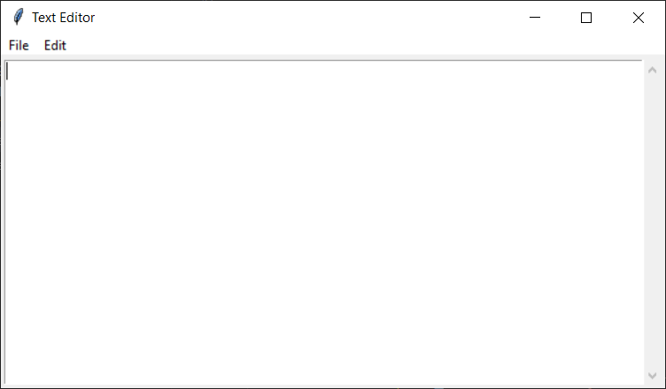

# Text-editor

Simple text editor on python tkinter

## Installation

1. Download the latest TextEditor.exe executable file directly from the [Releases](https://github.com/Vasya-556/Text-editor/releases/tag/v1.0.0) page.
2. Run the executable

## Contributing

Pull requests are welcome.

## License

[MIT](LICENSE)
